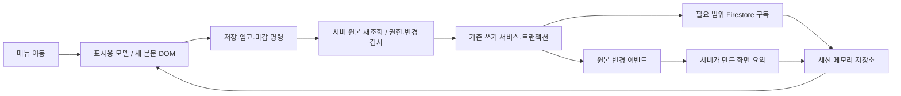

# 생산관리 로딩 구조 변경 실행 계획

작성: 2026-09-14. 상태: **프런트 1차 운영 배포 완료(23332c1, 파일37/37 검증). 서버 로컬 구현·검증 진행 — 실제 완료 범위는 [릴리스 기록](READPATH_RELEASE_20260914.md) 참조. 서버 운영 전환과 전체 메뉴 이행은 미완료**.

이 문서는 다음 구현자가 위에서 아래로 실행할 정본이다. 체크박스는 실제 산출물과 증거가 있을 때만 완료한다. `신설`로 표시한 파일·npm script·명령은 아직 존재하지 않으며 해당 단계에서 먼저 작성한다. 작업 기록은 [실행 체크시트](PERFORMANCE_EXECUTION_CHECKLIST_20260914.md)를 사용한다.

프런트 수명·서버 정합성·검증/배포 절차를 독립 검토하고, 발견된 전환 경합·집계 순서·lease 중복·권한 fallback·배포 재빌드 설정 문제를 계획에 반영했다. 이 검토는 구현 테스트 통과를 의미하지 않는다.

## 1. 기준 상태와 변경 경계

### 1.1 실행 직전 재확인할 기준

| 항목 | 계획 작성 때 확인한 값 |
| --- | --- |
| 프런트 저장소 | `C:\dev\fant-production`, remote `green-cloud-workroom/fant` |
| 현재 브랜치/HEAD | `feat/equipment-parts` / `8ed177c` |
| 운영 코드 | `dddae06` — HEAD와의 차이는 배포 검증 문서 |
| 선행 기능 | `a28a441` 설비 부품 기능. 반드시 보존 |
| origin/main | `bfa4e30`. **현재 운영 코드보다 뒤처져 있으므로 main에서 곧바로 빌드·배포하지 않음** |
| gh-pages | `68f87f0207908fd2d54ceb18debaf48e0f1be832` |
| 운영 주소 | `https://green-cloud-workroom.github.io/fant/` |
| 운영 검증 | 파일 33/33 일치, 14개 메뉴 진입 확인. 전체 업무 저장 회귀를 의미하지 않음 |
| 미추적 자료 | `output/` — 기존 성능 실험과 이번 계획 입력. 삭제하거나 일괄 커밋하지 않음 |
| 서버·규칙 소유 저장소 | `C:\dev\fantapet-inventory` |
| 서버 기존 설정 | `functions/src/index.ts`, Node 22, TypeScript, Functions codebase `default` |
| 규칙 정본 | inventory의 `firestore.rules.draft`, 인덱스 `firestore.indexes.json` |

시작할 때 양쪽 저장소의 status/HEAD/remote와 운영 자산을 다시 대조한다. 다른 작업이 있으면 그 변경을 보존하고 별도 worktree에서 진행한다. 위 해시와 다르면 diff를 읽어 계획의 기준을 갱신한다. 이전 상태로 reset하지 않는다.

### 1.2 이번 구현에서 유지할 업무 계약

- Auth의 `roles.production` / 앱 접근권한, 첫 인증의 현재 토큰 갱신 정책.
- 영양제 차감·환급, FIFO/재포장·동결 수량, 제품입고의 outbox, 회차·batchNo 계산.
- 환산표 `effectiveDate <= productionDate`, 같은 날짜의 `createdAt desc` 우선순위.
- 과거 마감 대상: 최근 **서로 다른 생산일 14개** + 가장 이른 미마감 후보, 기존 날짜 순서.
- `acknowledged !== true`, `received !== true`, `!closed`의 필드 누락/null 포함 의미.
- `productionCompletion` 마감 판정은 문서 ID가 아닌 `runDate` 기준.
- 화면 정렬에서 sortOrder 없는 생산을 제외하는 규칙과, 마감 검사에 그 문서를 포함하는 차이.
- 자동 알림의 현재 생성 조건·결정적 문서 ID·기존 확인 상태. 사용자 미접속일에 서버가 새 알림을 만드는 정책은 이번에 추가하지 않음.

### 1.3 금지와 승인 경계

시드/와이프 스크립트는 재실행하지 않는다. 생산 저장소의 rules 사본은 배포하지 않는다. 새 서버 요약은 원본 데이터를 수정하거나 차감하지 않는다. 프레임워크·DB·Hosting 교체와 디스크 캐시, 전 페이지 DOM 보관은 범위에서 제외한다.

현재 요청의 권한은 계획 작성이다. 단계00~10을 포함한 구현 착수는 후속 구현 지시 후 진행한다. 구현 승인이 있으면 프런트 개발·로컬 검증부터 진행할 수 있고, 운영 릴리스와 새 서버/스케줄러/규칙/비용 발생은 해당 실행 지시의 승인 범위를 확인한다. 승인이 이미 있으면 다시 묻지 않는다. 승인이 없다면 diff·테스트·정확한 배포 대상·예상 사용량을 준비한 뒤 최종 배포 단계에서만 확인한다. 서버 배포 승인이 미정이어도 승인된 구현의 로컬 작업은 진행한다.

## 2. 최종 구조와 선택한 정책



| 결정 | 실행 정책 |
| --- | --- |
| 화면 데이터 수명 | 로그인 세션이 소유. 페이지 이동 때 버리지 않음 |
| 캐시 위치 | 첫 릴리스는 탭 메모리만 사용 |
| DOM 수명 | 상단 유지, mainContent는 이동마다 새 노드. 기존 DOM 이탈 가드와 호환 |
| 공통 구독 | 첫 필요 시 시작, 같은 세션·같은 쿼리는 하나만 유지 |
| 비공통 구독 | 페이지 이탈 후 30초, 최근 2개 페이지까지만 유지. 시간은 최신성 보증이 아닌 자원 회수 정책 |
| 표시 모델 | 최근 3개 페이지 LRU. main 모델은 방문 후 세션 내 유지. 메모리 사용량을 측정하고 64MB 추정 soft cap 초과 시 비활성 모델/구독부터 해제 |
| 재방문 표시 | 준비된 모델은 즉시 사용. 구독이 해제됐거나 cache-only이면 갱신 중 표시 후 재연결 |
| 입력 중 외부 갱신 | 조회 영역만 갱신. 입력 초안은 유지, 저장 직전 변경 비교 |
| 원본과 요약의 권위 | 원본이 유일한 업무 기준. 요약/캐시는 표시용 |
| 자동 알림 | 렌더 밖 coordinator가 기존 조건으로 실행. 새 알림 생성 완료 전 상태를 별도로 표현 |
| 서버 요약 도입 | 먼저 원본 계산과 병행 비교, 일치 검증 후 메인 표시만 전환 |
| 단계별 회귀 | 각 단계 별도 커밋·flag·증거. 한 페이지 성공을 전체 이행 완료로 간주하지 않음 |

메모리 부족이나 구독 해제 후에는 0회 대기 재방문 목표의 적용 대상에서 빠진다. 서버 변경 통지·재연결 읽기까지 0회라는 뜻은 아니다.

## 3. 성공 지표와 측정 방법

목표는 출시 판단 기준이며 이미 달성한 실측값이 아니다.

| 지표 | 정의 | 1차 목표 |
| --- | --- | --- |
| warm first-content | 같은 세션, 필요한 모델/구독 준비 상태의 메뉴 클릭 → 실제 업무 내용이 paint됨 | 데스크톱 p95 <= 200ms, 느린 CPU 조건 p95 <= 350ms |
| warm new-query | 위 재방문 자체가 새로 시작한 DB 조회/리스너 | 0회. 데이터 변경 이벤트와 구분 |
| cold data-ready | 인증 완료 → 메인의 필수 데이터 준비 | 같은 fixture 조건에서 현재 대비 중앙값 >= 40% 단축; 운영 값은 새 baseline과 비교 |
| server update → view | 시험 데이터 변경이 구독에 수신된 때 → 조회 영역 paint | p95 <= 200ms. 서버 통지 지연은 별도 기록 |
| correctness | 원본 경로/새 경로의 표시 모델·업무 계산 비교 | 불일치 0건 |
| lifecycle | 100회 메뉴 전환 후 listener/handler 증가 | 동일 활성 쿼리 중복 0, 소유자 없는 구독·Chart·Sortable·timer 0 |
| 제출 전 검증 실패 | offline/permission/session/date/source-conflict | 업무 쓰기 0회. 제출 후 단절은 결과불명·자동 재발행0·서버 read-back으로 구분 |
| 서버 요약 신선도 | 원본 변경 후 해당 요약이 반영될 때까지 | 제어된 시험에서 p95 <= 5초, 최대 30초 초과 시 경보/원본 대체. 최초 서버 cold start는 별도 표본 |

### 계측 계약

신설 `src/perf/metrics.js`에서 `navigationStart`, `firstContentPainted`, `requiredDataReady`, `serverDataObserved`, `actionStart`, `actionFinished`를 session/navigation ID로 연결한다. 실제 내용 DOM 반영 뒤 다음 paint 기회를 기준으로 표시 지표를 찍는다. skeleton/이전 메뉴/빈 데이터 로딩 표시를 first-content로 세지 않는다.

각 표본에 route, cold/warm, cache state, data source, query/listener 수, JS 자산 바이트, sample environment를 기록한다. 사용자 이름·이메일·상품명·로그 본문·토큰은 계측에 저장하지 않는다. 서버 확인 시각은 '그 응답을 확인한 시각'이며 전 컬렉션 원자성 증명으로 쓰지 않는다. `onSnapshotsInSync`도 서버 최신성 판정으로 쓰지 않는다.

로컬 50/150ms 지연 fixture, 외부 변경이 있는 fixture, 실제 운영의 읽기 전용 진입을 분리한다. 각 조건 최소 20회, p50/p95와 전체 표본을 남긴다. 기존 도구 클릭 경과 3초는 참고치이며 새 client mark와 직접 비교하지 않는다. 운영 저장 테스트는 fixture/emulator 통과 후 승인된 검증 데이터로만 한다.

## 4. 변경 파일과 데이터 계약

### 4.1 프런트 파일 지도

| 파일 | 구체 작업 |
| --- | --- |
| `tests/helpers/modules.mjs` | await readFile 이전 cache 등록 누락으로 같은 VM 모듈이 중복 생성되는 문제 수정. Promise 등록 또는 sync read로 단일 인스턴스 보장 |
| `src/perf/metrics.js` 신설 | 위 계측, opt-in export, 업무 데이터 제외 |
| `src/services/serverReadScope.js` 신설 | getDocFromServer/getDocsFromServer만 사용, 요청 한 번 내 중복 공유. 화면 store와 연결하지 않음 |
| `src/services/actionGateway.js` 신설 | id/date/사용자 epoch 기반 업무 진입, 서버 재수화·변경 비교·중복 제출 차단 |
| `src/utils/closingGuard.js` | 조회 실패를 허용으로 처리하는 분기 제거, 인앱 오류 안내 후 차단 |
| `src/services/closingChecks.js`, `src/closing.js` | 표시 입력 provider와 command server provider를 명시적으로 분리. 기본 동작은 command freshness 우선 |
| `src/state/queryRegistry.js` 신설 | 명시적 쿼리 키와 참조/정규화/소유권 정의 |
| `src/state/sessionStore.js` 신설 | immutable snapshot + metadata + 세션 epoch + model cache |
| `src/state/listenerPool.js` 신설 | query당 1구독, owner ref count, release/재연결/에러 처리 |
| `src/state/sessionController.js` 신설 | Auth/token/day lifecycle, 늦은 응답 폐기 |
| `src/domain/mainViewModel.js`, `src/domain/businessCalendar.js` 신설 | 순수 모델·날짜 계산 추출. 기존 판단 함수 결과 유지 |
| `src/services/mainViewSource.js` 신설 | legacy/session/summary provider를 같은 ViewModel 계약으로 변환 |
| `src/services/autoLogCoordinator.js` 신설 | 현재 알림 생성 조건을 렌더와 분리, 기존 autoLogs 트랜잭션 재사용 |
| `src/services/autoLogs.js`, main의 알림 조건 조회 함수 | 삼킨 실패를 구조화된 결과로 반환. 알림 생성·확인 상태의 업무 계약은 유지 |
| `src/config/performanceFlags.js` 신설 | 단계별 build flags, 사용자가 켤 수 없는 emergency disable |
| `src/main.js`, `src/app.js`, `src/midnightLogout.js` | session controller 연결, clearUserInfo, 절전 복귀 날짜 재확인 |
| `src/layout.js`, `src/router.js` | shell 유지, navigate 단일 진입점, legacy adapter, 새 본문 host |
| `src/utils/pageLifecycle.js`, `src/utils/modalManager.js`, `src/utils/formDraft.js` 신설 | dispose·dirty·modal 소유자·입력 보존 |
| `src/pages/*.js` | 아래 단계 06의 순서대로 조회만 새 모델에 연결. 쓰기는 gateway 검증 후 기존 서비스 사용 |
| `scripts/measureReadpath.mjs`, `scripts/verifyReadpathRelease.mjs` 신설 | client marks 표본 검증, 자산 hash/배포 manifest 검증 |
| `scripts/deployReadpathRelease.mjs` 신설, `package.json`의 deploy | 승인 manifest의 flags로 재빌드하고 전송 직전 전체 자산 hash 일치를 검사한 뒤 gh-pages 실행 |

폴더·파일 이름은 이 계획의 구현 결정을 따른다. 동일 목적의 기존 helper가 확인되면 기능을 합치되 정본 파일 지도와 테스트 이름을 함께 고친다. 불필요한 전역 상태 계층/프레임워크는 추가하지 않는다.

### 4.2 Snapshot과 Query 계약

```js
// 세션 키: uid + production claims fingerprint + KST dayKey + epoch
// key에는 Firestore Query 객체 JSON 직렬화를 쓰지 않는다.
resolveQuery(name, params) => {
  key, ref, kind: 'doc' | 'query', normalize, allowedRoles, lifetime
}

// ResultEntry: undefined와 수신한 []를 구별
{
  sessionEpoch, queryKey, data, revision,
  status: 'empty' | 'loading' | 'ready' | 'error',
  fromCache, hasPendingWrites, receivedAt, serverObservedAt,
  invalidated, error
}

store.peek(key)
store.subscribe(key, callback) // 현재 값 즉시 전달; 해제 함수 반환
store.publish(key, result, epoch)
store.invalidate(keys, reason)
store.clear(reason)

pool.acquire(name, params, { owner, onValue }) // {key, release}
pool.releaseOwner(owner)
pool.dispose(reason)
pool.inspect() // 개발 계측용 count, 데이터 없음
```

물리 listener는 `(sessionEpoch, queryKey)`당 최대 하나. SDK `onSnapshot`에 metadata 변경을 포함한다. 늦게 온 callback은 owner/epoch를 검사한다. permission-denied이면 해당 데이터와 업무 버튼을 숨기고 세션을 재확인한다. transient 오류에는 이전 자료+갱신 상태를 보여주며 성공한 빈 결과로 치환하지 않는다. local pending write 표시와 '저장 완료'는 구분한다.

첫 쿼리 registry는 기존 쿼리를 그대로 명시해 동등성을 확보한다. 이후 별도 커밋으로 묶는다:

| 데이터 | 1차 공유/조회 정책 | 주의 |
| --- | --- | --- |
| recipes/meatTypes/bagTypes/supplementTypes | 동일 쿼리만 합침. ordered/all은 별도 계약 | orderBy가 필드 없는 문서를 제외함 |
| eggStock/global, meatStocks, supplementStock | 상단/main 공유 | `closed == false` 치환 금지 |
| productions | day/calendar/all 계약 분리 후 비정렬 원본→화면 파생 동등성 확인 | 최근 생산일 14개를 문서 14개로 바꾸지 않음 |
| schedules | main·상단·마감은 scheduled 공유 가능, 관리 페이지 이력은 별도 | completed/cancelled 이력 화면 누락 금지 |
| activityLogs | 날짜 목록/오늘/최근 10일 계약 명시 | ack 누락 포함, 과거 로그의 현재 필터 유지 |
| closings | 마지막 마감 1건 + 후보 날짜 묶음 | 문서 ID 날짜/누락 미마감; command는 별도 서버 조회 |
| completion/eggLogs/frozenPanStock | 후보 날짜에 필요한 조회, 최초엔 기존 판정 입력 그대로 | completion.runDate, status 누락 처리 |
| holidays | 공통 master 변경 시 business-day 모델 모두 무효화 | static holiday와 운영 override 우선순위 유지 |
| equipmentParts/equipments | 현재 두 서비스 계약 그대로 공유 | 날짜만 지나도 due가 바뀜 |
| staffGroups/settings | 문서별 키. 설정은 섹션 펼칠 때 조회 | 권한과 담당자 이름 기준 유지 |

날짜 묶음 조회가 실패하면 실패한 묶음만 일별 서버 조회로 대체한다. 전체 배치 실패를 기존 앞 날짜의 정상 판정 대신 반환하지 않는다. 정상 경로와 실패 4종은 기존 output 프로브를 정식 테스트로 이관한다.

### 4.3 ViewModel/화면/명령 분리

`mainViewModel`은 현재 main.js가 보유한 productions/nextProductions/overdueProductions, recipes, meatStocks, eggStock, completion, blockingData, calendar, combinedLogs, equipmentAlerts를 담되 DTO와 의존 revision을 명시한다. 항목에는 원본 ID와 표시값을 유지한다. cache 모델 객체를 정렬·수정하지 않는다.

`mountPage(ctx) -> {dispose, canLeave, getViewState}`:

```js
ctx = {host, menuId, params, sessionEpoch, navigationEpoch,
       store, pool, signal, isCurrent, registerCleanup, modal}
```

모든 이동은 `navigate`로 통합한다. 첫 await 전에 transition ID를 발급하고 한 번에 하나의 dirty 확인만 허용한다. 진행 중 추가 메뉴 요청은 마지막 목적지만 대기시킨다. 순서: 접근권한 확인 → dirty/저장 상태 확인 → session/transition ID 재검사 → 이전 dispose → navigation epoch 증가 → 새 mainContent 생성 → cached 표시 → 구독 연결. 취소 시 URL/선택 메뉴도 유지하고 외부 hash 변경은 복원한다. 로그아웃/권한 변경은 대기 이동을 폐기한다. 이전 페이지의 DOM/timer/Sortable/Chart/모달 callback은 dispose에서 정리한다. 미이행 페이지는 legacy adapter로 기존 render를 호출한다.

명령 진입은 `{action, targetId, targetDate, sessionEpoch}`만 gateway로 전달한다. 화면에 보관한 production/recipe/stock 객체를 쓰기 함수의 업무 원본으로 전달하지 않는다. 서버 재수화 후 draft를 만들고, 최종 확인에서 다시 읽어 업무 관련 fingerprint/receivedRevision이 달라졌으면 입력을 보존한 채 재검토 안내 후 중단한다. 첫 쓰기 제출 전 네트워크/권한/세션/날짜 확인 실패는 쓰기 0회로 끝낸다. 제출 이후 세션 종료·단절은 이미 전송된 쓰기를 취소했다고 보장하지 않고, 결과불명·자동 재발행 금지·서버 read-back으로 처리한다.

이 선행 조회는 이후 다른 사용자가 동시에 쓰는 TOCTOU까지 제거하지 않는다. 기존 raw 입고의 batch/outbox revision 할당과 전 앱 마감 원자성은 아래 별도 SC 범위다. 이 계획의 1차 성능 릴리스는 '동시성 완전 해결'을 주장하지 않는다.

## 5. 실행 단계 00~07: 프런트 구조

### 00. 기준 고정·계측·테스트 장치 정리

- [ ] 두 repo status/HEAD/remote/현재 배포를 기록하고 `codex/production-readpath-v2` 프런트 작업 브랜치를 **현재 검증된 운영 코드를 포함한 HEAD**에서 생성한다. 실행 당시 분기점이 바뀌면 merge-base/diff부터 확인한다.
- [ ] 별도 worktree에서 구현한다. 기존 설비 기능과 output 자료를 보존한다.
- [ ] 테스트 VM loader 단일 인스턴스 문제를 수정하고 날짜/cache가 1개 모듈임을 검증한다.
- [ ] 현행 20 performance + 24 phase3a + 18 phase3b 검증을 기준으로 저장한다. 통과 수를 최신 실행으로 재확인한다.
- [ ] 신규 `test:readpath`, `test:readpath:integration`, `perf:measure`, `verify:readpath-release` script를 package.json에 등록한다. Node test runner를 사용하고 브라우저 계측 연결은 별도 runner로 분리한다.
- [ ] 현재 코드의 client marks 기준 baseline JSON·빌드 manifest를 저장한다. 계측 off에서도 기능과 번들 비용이 거의 같도록 구현한다.

완료: 동일 fixture에서 source state/호출 수가 반복 실행마다 안정적이고, 실제 내용 paint와 skeleton을 구별한 표본이 있다. 코드 커밋+baseline artifacts 위치를 기록한다.

### 01. 캐시 확대 전 명령 경계 보강

- [ ] `createServerReadScope` 구현. SDK 캐시 결과를 command의 최신 확인으로 사용하지 않는다.
- [ ] `blockIfClosed`를 server provider 사용 + 실패 시 차단으로 변경한다. 오류 안내는 인앱 UI, 재시도 선택 가능. 서버에서 확인된 문서 부재는 기존처럼 미마감이며, 조회 실패와 구별한다.
- [ ] main 제품입고·완료 재불러오기·마감/해제, production 신규/수정/삭제, 각 재고 조정의 `open → confirm → service` 경로를 `ACTION_PATHS.md` 신설 표에 기록한다.
- [ ] 우선 main 입고/마감 gateway 연결. 모달 열 때뿐 아니라 최종 확인 직전에 source·날짜·세션·마감/차단 조건 재확인. 새 경고가 생기면 이전 경고 동의를 재사용하지 않는다.
- [ ] 캐시 객체를 넘기는 경로, 오류를 삼키고 쓰기를 계속하는 경로, gateway 없는 직접 버튼 경로를 찾는다. 하나라도 남은 행위는 해당 route의 session flag 활성화 대상에서 제외한다.
- [ ] 같은 form 제출은 진행 중 1개만 허용. 이미 전송된 쓰기는 화면 이탈로 취소됐다고 표시하지 않는다. 결과 불명 상태는 무조건 재전송하지 않고 서버 결과 확인으로 보낸다.

완료: 제출 전 offline·permission·로그아웃·날짜 이동·source 변경·이전 모달 재확인 실패에서 쓰기 0, 제출 후 단절에서 자동 재발행0, 정상 입력의 기존 계산/문서 payload 일치. 새로운 재고 계산식은 만들지 않는다.

### 02. 순수 모델 추출과 조회 계획 정리

- [ ] main의 조회/변환/렌더/자동 알림을 분리하되 legacy 경로로 계속 실행한다.
- [ ] 날짜 함수 중 Firebase IO와 순수 business calendar를 분리한다. 휴일 override·deleted 문서·동일 effectiveDate tie-break를 golden fixture로 고정한다.
- [ ] mainViewModel의 목록 순서·수량·로그 분류·차단/경고·캘린더가 기존과 같은지 비교한다. Timestamp 정렬을 숫자/string으로 임의 변경하지 않는다.
- [ ] 앞서 검증한 독립 조회 선행 시작을 적용한다. 오늘/과거 로그·이벤트·예정·영양제 읽기를 일찍 시작하되 상태/쓰기를 조기 확정하지 않는다.
- [ ] 새 알림 작성 후에는 오늘 로그만 재조회하고 이미 받은 과거 로그와 합친다. 오류 재시도/다른 탭 생성·확인 상태 보존 검증을 추가한다.
- [ ] 별도 커밋으로 날짜 IN 묶기/생산 원본 공유/예정 상태 공유를 적용한다. API 감소와 전송 문서 수·성능 효과를 각각 기록한다.

완료: 일반·과거 미처리·신규 알림·삭제·필드 누락·쿼리 오류에서 legacy와 state/payload 일치. 개선율은 이 단계의 새 계측으로 기록한다.

### 03. 공용 저장소·구독 풀·세션 구현

- [ ] 4.2 계약대로 registry/store/pool/controller를 구현하고 아직 운영 UI에는 연결하지 않는다.
- [ ] 동일 key 중복 acquire, 늦은 callback, refcount/30초 grace/LRU, metadata-only 변경을 fake listener로 검증한다.
- [ ] 최초 Auth 토큰 확인은 유지한다. token observer에서 매번 강제 갱신하지 않아 반복 루프를 방지한다. 같은 UID/동일 claims의 토큰 갱신은 캐시를 비우지 않는다.
- [ ] 로그아웃/UID·claims 변경은 epoch를 즉시 폐기한다. app.js에 clearUserInfo를 추가한다.
- [ ] 탭 복귀/pageshow에서 KST 날짜·세션 확인. 날짜가 바뀌면 기존 자정 로그아웃 정책을 적용하고 그날 캐시/초안을 폐기한다.
- [ ] 오류/빈 결과/오프라인/pending write를 서로 다른 상태로 테스트한다. permission-denied 결과는 이전 민감 내용을 계속 노출하지 않는다.

완료: session isolation, 한 key당 listener 1개, 메모리/owner 해제와 새 세션의 0개 잔류가 확인된다.

### 04. 상단 유지·라우터·모달 수명 전환

- [ ] `renderLayout`을 mountShell/updateShell/disposeShell로 분해하고 navigate 단일 진입점으로 menu/hash/jump를 통합한다.
- [ ] 먼저 legacy data mode에서 DOM 변경만 검증한다. 다음 커밋에서 상단 query를 pool로 연결한다.
- [ ] 전환 시 mainContent는 새 노드로 교체. legacy 비동기 로더는 로컬 결과 반환 → session/navigation epoch 확인 → 모듈 상태 설치 순서로 바꾼다. equipment.reloadAll/supplement.loadSupplementData처럼 DOM 가드 전에 전역을 덮는 경로도 포함한다. 오래된 결과가 다음 방문의 이벤트 핸들러가 참조하는 상태를 바꾸면 실패다.
- [ ] window.closeModal bridge를 modalManager 하나가 소유하도록 바꾸고 route owner별 cleanup을 등록한다. 여러 페이지의 import가 모달 함수를 덮어쓰지 않게 한다.
- [ ] dirty form에서 이동 선택: 계속 작성 / 이동. 확인 전에는 URL·view·draft 유지. 이동은 업무 저장이 아니다.
- [ ] dirty 확인 중 B/C 이동 요청, 확인 응답 역순, 확인 중 로그아웃에서 pending transition이 현재 세션과 일치할 때만 적용되는지 검증한다.
- [ ] stats timer/Chart, 모든 Sortable, DOM listener, 모달 escape/click handler의 정리 계약을 검증한다.

완료: 100회 이동·빠른 A→B→A·뒤로/앞으로·logout·dirty 이동에서 중복 이벤트/옛 화면 덮기/입력 손실 0. 현재 14개 메뉴와 내부 freezeOp 진입 모두 legacy mode에서 통과.

### 05. 메인과 자동 알림 coordinator 전환

- [ ] main 최초 진입은 provider가 필수 데이터를 받으며 패널별 상태를 표시한다. 재방문은 cached mainViewModel로 표시 후 변화만 반영한다.
- [ ] 생산·캘린더·로그·설비 조회 영역을 각각 갱신하고 열려 있는 업무 form은 재렌더하지 않는다.
- [ ] 자동 알림을 렌더 함수에서 제거하고 coordinator로 옮긴다. 세션/날짜/원본 revision을 key로 같은 작업을 병합하고 기존 결정적 ID+최대4 transaction 동시성은 유지한다.
- [ ] 알림 조건 조회는 `evaluate → {alerts, failedChecks}`, 쓰기는 `flush → {createdIds, existingIds, failedIds}`를 반환한다. 기존 `flush`의 오류 후 true 반환과 조건 조회 내부 catch를 고친다. 하나라도 실패가 남으면 coordinator는 성공 상태가 아니며, 실패 항목만 bounded 재시도한다. 기존 문서 확인/새 문서 생성 여부는 transaction의 실제 결과로 구분한다.
- [ ] 메인 방문이라는 기존 생성 조건을 유지한다. 최초 방문 이후 관련 원본 변화의 재평가 방식은 현재 메인 refresh에 준하며, 미접속일의 신규 로그를 서버가 만들지 않는다.
- [ ] 생성 중 상태와 실패/재시도를 표시한다. 이벤트·예정 알림 생성이 아직 미완료인데 마감 검사를 완료로 간주하지 않도록 final command가 원본 알림 조건을 검사하거나 coordinator의 성공을 기다리게 한다.
- [ ] main 제품입고·내일 생산불러오기·마감/해제는 단계 01 gateway 경로만 사용한다. summary/store DTO를 직접 mutation에 전달하지 않는다.

완료: 준비된 main 재방문 new-query 0, first-content 목표 통과. 6조건×현재/변경안×3회로 수행한 36회 선조회 실험과 알림 초기 생성/다른 탭 ack/실패/날짜 전환이 정식 테스트에서 통과한다.

### 06. 나머지 메뉴 이행 — 각 행 별도 커밋과 gate

| 순서 | 대상 | 읽기 변경 | 활성화 전 명령·수명 검증 |
| --- | --- | --- | --- |
| 06-1 | recipe | 목록/선택/master store | active·preset·환산·drag 최신 원본, Sortable 정리 |
| 06-2 | settings | 8개 접힌 섹션은 펼칠 때 조회, priceHistory N+1 지연 | 담당자/휴일/설정/단가 draft 충돌, 일괄변경 서버 재확인 |
| 06-3 | production | 선택 날짜 model, recipe/staff 공유 | 차감·환급·round·batch·sortOrder·환산 golden parity |
| 06-4 | bag / equipment | 품목·담당자 모델, equipment 담당자3개 병렬 | 조정/교체/입고 최신원본, old due/date 처리 |
| 06-5 | supplement / schedule | 표·선택일 모델, XLSX 클릭 시 import | 차감/수동조정/예정 완료·취소·알림 관계 |
| 06-6 | egg / frozenProduct | 현재 재고와 이력 분리 | 출고·입고·재고조정·송신/수신 계약 |
| 06-7 | frozenPan / freezeOp / frozenSep | 활성 tab/기간 모델 | lot/FIFO/분리·발주/작업 row와 modal cleanup |
| 06-8 | meat | 단계별 조회 모델; 이력 축소와 쓰기변경 동시 적용 금지 | 전처리/재포장/수동조정/FIFO/자동 로그 전체 |
| 06-9 | stats | 기간 key, XLSX 클릭 시 로드 | query epoch·chart destroy·timer 정리, 집계/다운로드 결과 parity |

각 행은 역할 3종 중 접근 가능한 역할, 빈 자료/자료 있음, 외부 수정·삭제, draft 보존, gateway 우회 0을 확인하고 route allowlist에 추가한다. 실패한 route는 legacy 유지하고 다른 완료 route의 작업을 막지 않는다.

### 07. 1차 프런트 릴리스

- [ ] flag 조합 legacy / shell+store main / 이행 완료 routes를 모두 빌드한다.
- [ ] fixture와 emulator의 correctness/lifecycle/action gate를 통과한다.
- [ ] source commit, flags, asset hashes, metrics JSON을 release manifest로 만든다.
- [ ] deploy wrapper와 package.json의 deploy를 연결한다. manifest의 source/flags로 다시 build한 전체 자산이 승인 hash 목록과 다르면 gh-pages 전송 전에 중단한다. flags 누락/파일 추가·누락/소스 변경을 주입한 실패 테스트를 포함한다.
- [ ] 아래 릴리스 절차에 따라 프런트만 배포하고 읽기 전용 운영 메뉴/계정·자산·client marks를 확인한다.
- [ ] 메인/설정 개선과 이행 완료 메뉴만 보고한다. 아직 legacy인 메뉴를 명시한다.

이 단계 완료만으로 서버 요약·Functions·rules를 배포하지 않는다. 서버 단계는 뒤의 별도 gate를 따른다.

## 6. 보호 기능 별도 범위 SC

| 항목 | 이번 성능 이행의 최소 조건 | 별도 강화 작업 |
| --- | --- | --- |
| 마감 조회 실패 허용 | 단계01에서 실패 시 차단 필수 | 없음; 캐시 전환 선행 수정 |
| raw 제품입고 receivedRevision/outbox batch | gateway에 ID만 전달, confirm 서버 재조회/변경 비교, fresh 값으로 기존 command | SC-1: production+closings와 필요한 원본 read를 같은 transaction에 넣고 revision 할당·outbox 쓰기를 함께 확정 |
| 최종 마감 모달 뒤 상태 변경 | confirm 직전 server 재판정/새 경고 동의 | SC-2: 전체 마감 원자성·서버 command 모델. 여러 컬렉션 predicate phantom까지 포함하는 별도 설계 |
| 취소 불가능한 전송 중 요청 | session 종료 시 화면 폐기, 결과 불명 확인, 무조건 재시도 금지 | 작업 ID 기반 멱등 command 확장 |

SC-1/SC-2를 완료하지 않고 완전한 동시성·중복 방지를 보장했다고 보고하지 않는다. gateway가 적용되지 않은 행위는 session route 활성화에서 제외한다. 이 한계를 없애는 요청이 있으면 SC를 별도 검증·승인 범위로 진행한다.

## 7. 서버 요약의 확정 계약

### 7.1 소유 파일과 실행 환경

서버 구현은 inventory의 별도 `codex/production-dashboard-v1` worktree에서 한다. 생산 repo에 Firebase Functions 설정을 복원하지 않는다.

| inventory 내 경로 | 작업 |
| --- | --- |
| `functions/src/productionDashboard/contracts.ts` 신설 | View/Chunk/DayFacts/Job/SourceState/Control 타입·검증 |
| `functions/src/productionDashboard/domain.ts` 신설 | 같은 fixture의 순수 마감·날짜·main model adapter |
| `functions/src/productionDashboard/sourceProjection.ts` 신설 | 제한된 원본 경로 observer, 현재 원문 재조회, dirty 등록 |
| `functions/src/productionDashboard/dayFacts.ts` 신설 | 날짜별 사실 재계산 |
| `functions/src/productionDashboard/overview.ts` 신설 | 후보 날짜/현재 경고/캘린더/첫 화면 조합 |
| `functions/src/productionDashboard/worker.ts` 신설 | lease/generation/publish/fallback/retry |
| `functions/src/productionDashboard/rollover.ts` 신설 | 자정 갱신·회수 sweep |
| `functions/src/productionDashboard/verify.ts` 신설 | 원본 독립 계산과 요약 비교 |
| `functions/src/productionDashboard/index.ts` 신설 | 이 기능의 handler exports |
| `functions/src/index.ts` | 신규 handler만 명시 export, 기존 초기화·함수 유지 |
| `functions/scripts/productionDashboardBackfill.mjs` 신설 | dry-run 기본, projection-only apply/checkpoint |
| `functions/scripts/productionDashboardVerify.mjs` 신설 | 원본 read-only 비교, 불일치 보고 |
| `functions/scripts/setProductionDashboardMode.mjs` 신설 | off/shadow/serve 제어, projection 전용 쓰기 |
| `functions/scripts/deployProductionDashboard.mjs` 신설 | 배포 allowlist 검사·dry-run·정확한 신규 함수명만 실행 |
| `functions/productionDashboard.deploy.json` 신설 | 함수명/region/runtime/timeout/maxInstances/concurrency 명세 |
| `firestore.rules.draft`, `firestore.indexes.json` | 신규 projection match/index만 추가. 기존 5앱 규칙 보존 |
| `functions/package.json` | 해당 기능의 test/backfill/verify/deploy-dry script 추가 |

서버 프런트 사이 런타임 형제 repo import는 하지 않는다. 순수 판정은 생산 repo의 기존 함수와 golden fixtures를 정본으로 삼고, 서버 TypeScript adapter는 **동일 입력·출력 parity**로 검증한다. `logicVersion`, 프런트 순수 코어 파일 hash, fixture hash를 계약 manifest로 고정한다. 둘 중 하나가 바뀌면 동시 호환 검증 없이 summary serve를 허용하지 않는다. 자동 복사된 검증 fixture와 출처 hash는 서버 repo에도 커밋한다.

### 7.2 공개 root와 chunk

첫 구현 경로는 아래로 고정한다. 현재 생성된 컬렉션은 아니다.

```js
// productionDashboardViews/v1__YYYY-MM-DD
{
  schemaVersion: 1,
  logicVersion: '고정된 계약 버전',
  readModelMode: 'off' | 'shadow' | 'serve',
  controlRevision: 0,
  validForKstDate: 'YYYY-MM-DD',
  generation: 0,
  buildId: 'lease마다 새로 발급한 불투명 ID',
  generatedAt, lastSuccessAt,
  rebuildState: 'ready' | 'updating' | 'error',
  refreshRequestedAt, requestedGeneration,
  sourceJobGeneration: 0,
  dateContext: {today, nextProductionBusinessDay, calendarStart, calendarEnd},
  overview, productionCards, calendar, logPanels, equipmentAlerts,
  sections: { /* section -> inline/required/rowCount/chunkIds */ }
}

// productionDashboardViews/v1__YYYY-MM-DD/chunks/G__BUILD__SECTION__PAGE
{schemaVersion: 1, generation, buildId, section, page, rowCount, payloadHash, rows}
```

- 현재 main의 모든 production 역할에 허용된 필드만 넣고 escape 가능한 DTO로 만든다. HTML·토큰·이메일·직원 개인정보·재고앱 주문 상세·임의 로그 before/after 전체를 복사하지 않는다.
- 정상 크기는 root에 기본 내용을 inline하여 manifest 왕복을 추가하지 않는다. 문서 직렬화 추정 600KiB를 넘기면 분할을 시작하고 실제 SDK write 크기 한도도 검사한다.
- 현재 보이는 생산 카드나 로그 행을 성능 이유로 몰래 잘라내지 않는다. 같은 내용을 여러 chunk로 분할한다. 로그 pagination UI를 추가하려면 별도 승인된 표시 계약으로 분리한다.
- chunk를 모두 기록·검증한 후 root pointer를 마지막에 교체한다. lease마다 다른 buildId를 사용하고 chunk는 create-only로 기록한다. 같은 ID가 이미 있으면 payload hash 일치만 확인한다. lease를 잃은 worker는 승리한 root가 참조하는 chunk 경로를 덮어쓸 수 없다.
- 클라이언트는 root의 generation/buildId에 속한 필수 chunk만 조합한다. 누락/다른 세대/검증 실패는 마지막 정상 모델 유지+원본 fallback. 일부 수량만 새 세대로 섞지 않는다.
- `generatedAt`은 원본 전체의 최신 watermark가 아니다. 아직 전달되지 않은 source event를 집계 세대로 알아낼 수 있다고 가정하지 않는다.
- 초기에는 root/chunk 자동 삭제를 넣지 않는다. 롤백 호환과 이전 세대 client를 확인한 다음 projection 경로 전용 정리 작업을 별도 추가한다.

### 7.3 서버 전용 문서

| 경로 | 주요 필드/목적 |
| --- | --- |
| `productionDashboardDayFacts/{YYYY-MM-DD}` | date, hasProduction, 유효생산/미입고/노른자 수, 계란출고 존재, 발주·예정·3종로그 미처리 사실, runDate 완료, closed, desired/applied generation, logicVersion |
| `productionDashboardSourceState/{collection}__{hash(path)}` | sourcePath, exists/deleted, fingerprint, lastAffectedDates, logicVersion. 재생성 가능한 처리 상태 |
| `productionDashboardJobs/{kind}__{key}` | kind는 day/view만 사용. desiredGeneration/appliedGeneration/state/dirtySince/notBefore/nextAttemptAt/leaseToken/leaseExpiresAt/buildId/attempts/lastErrorCode |
| `productionDashboardControl/runtime` | off/shadow/serve, controlRevision, logicVersion, limits, activeViewDates(최대3개), pendingDayJobs, backfill runId/phase(required/discovering/building/verifying/complete) |

내부 문서는 client read/write 모두 금지한다. projection adapter는 write ref의 root collection이 위 5개 namespace 이외이면 즉시 거절한다. Admin SDK가 rules를 우회하므로 코드·테스트 수준 allowlist가 필수다. 원본에 transaction/set/update/delete하는 API를 projector에 주입하지 않는다.

### 7.4 영향 행렬 — create/update/delete 전부 적용

| source path | 직접 facts/표시 갱신 | 추가 영향 |
| --- | --- | --- |
| `productions/{id}` | old/new date, 카드/노른자/미입고 사실 | hasProduction 변화 시 최근14일 재선정, 그 날짜를 next-business-day로 참조하는 판정 |
| `productionCompletion/{id}` | old/new runDate 사실과 화면 ID 참조 | 완료 취소·다시 불러오기 |
| `closings/{date}` | 그 날짜 closed | 마지막 closed·earliest 후보·현재 버튼 재선정 |
| `eggLogs/{id}` | old/new date의 type out 사실 | 노른자 생산 차단 |
| `frozenPanStock/{id}` | old/new date/type/status | 미확인 발주, status 누락 포함 |
| `schedules/{id}` | old/new date/status, 캘린더 | today due와 date<=today 상단 건수 |
| `activityLogs/{id}` | old/new date/action/subAction/ack | 오늘 패널·최근10일·최근14생산일 차단. 양 앱과 admin 삭제 포함 |
| `events/{id}` | old/new date 캘린더/알림 조건 | 기존 생성 의미와 표시 갱신 |
| `holidays/{id}` | holiday context version | 현재/후보 전체 next-day 연결과 캘린더 재조합 |
| `recipes/{id}` | 현재 카드가 참조하는 표시/fallback | snapshot 없는 과거 자료와 변환 단위 |
| `recipes/{id}/conversionHistory/{entry}` | 해당 recipe의 현재 표시/fallback 영향 | effectiveDate/createdAt 우선순위 유지 |
| `meatTypes/{id}`, `meatStocks/{id}` | 현재 합계/최소재고 | closed·remaining·분류 변경, 모든 날짜의 현재 경고 |
| `bagTypes/{id}`, `eggStock/{id}` | 현재 수량/최소재고 | 상단·경고·현재 알림 조건 |
| `supplementTypes/{id}`, `supplementStock/{id}` | 활성 SKU/수량 | stock 문서 없음, SKU 삭제·비활성화 |
| `equipmentParts/{id}` | 재고·예정일·표시 | 배지/팝업/알림. D-day는 rollover도 필요 |
| `settings/{id}` | closingFlags/systemValues 등 명시 allowlist만 | 현재 모든 후보 판정 또는 실제 표시 의존값 |
| KST 날짜 전환 | view day, 10일 log window, 14일 calendar | 주말/휴일/설비 due/earliest 계산 |

`equipments`/`staffGroups` 등 추가 의존은 실제 DTO 필드가 원본을 참조할 때만 등록한다. 현재 snapshot 이름이 있는 경우 저장 방식과 대조한다. `productTransferRequests`와 forecast 데이터는 이번 요약의 입력·출력에서 제외한다. 임의의 모든 root collection을 감시하는 generic trigger를 만들지 않는다.

영향 날짜는 SourceState의 마지막 적용 날짜 + event before/after 날짜 + 현재 원문 날짜의 합집합이다. source event가 늦게 와도 현재 원문을 재조회한다. initial 버전은 현재 view를 넓게 dirty 처리하며, 좁은 영향 최적화는 parity 확인 후 한다.

### 7.5 세대·lease·재시도 알고리즘

**source observer**

1. 함수 prefix는 `productionDashboard`로 통일하고 7.4의 source별 명시 handler를 export한다.
2. transaction에서 현재 source와 SourceState를 읽는다. 현재 존재 여부/updateTime/필요 필드 hash/logicVersion이 같으면 중복 이벤트로 종료한다.
3. 달라졌으면 SourceState와 영향을 받는 day/view job의 desiredGeneration을 같은 transaction으로 갱신한다. v1에 global job은 만들지 않는다. 날짜 원본은 day와 현재 view를 dirty 처리하고, master 변경은 현재 view만 dirty 처리한다. day job이 clean에서 dirty로 바뀔 때만 Control.pendingDayJobs를 1 올린다. 이미 dirty인 작업의 새 세대에는 카운트를 추가하지 않는다. source에는 쓰지 않는다.
   해당 view가 clean→dirty가 될 때 공개 root에도 rebuildState를 `updating`으로, refreshRequestedAt/requestedGeneration을 기록한다. 이미 갱신 중이면 최초 요청 시각을 유지한다. 기존 rows/generation/buildId/mode는 보존한다. 새 root가 없으면 데이터 없는 updating manifest만 만들고 client는 원본으로 대체한다. job이 dirty인데 client root가 계속 ready인 상태로 남지 않게 한다.
4. delete→같은ID 재생성→늦은delete 순서도 현재 원문 기준으로 계산한다. 전 이벤트 payload의 값을 단순 가감하지 않는다.

day job 생성·dirty 변경은 source observer/backfill/rollover/missing-facts 모두 같은 공용 enqueue를 사용한다. Control.pendingDayJobs의 clean→dirty 1회 증가와 view 요청 표시를 우회하는 직접 job 쓰기를 금지한다.

**worker**

1. 초기 기본값: coalescing 500ms, burst 최대 대기 2초, lease 120초, worker timeout 90초/계산 deadline 60초, worker maxInstances 2/concurrency 1. 남은 시간은 결과 기록과 lease 정리에 사용한다. 관측 후 한도 변경은 별도 manifest 변경으로 기록한다.
2. Job write trigger는 `desiredGeneration > appliedGeneration`인 경우만 후보가 된다. lease 획득 transaction은 state/notBefore/nextAttemptAt/lease 만료와 Control의 처리 허용·버전을 함께 검사한다. view는 targetDate가 현재 activeViewDates에 있어야 한다. 미래 retry 시각·유효한 다른 lease·제외된 view 날짜이면 종료하고, 상태 쓰기 자체를 즉시 재계산 사유로 삼지 않는다.
3. 짧은 coalescing 후 transaction으로 만료/미소유 lease를 얻고 desiredGeneration/controlRevision을 캡처한다. leaseToken과 buildId를 매번 새로 만든다.
4. day worker는 해당 날짜 원문을 재조회해 raw DayFacts를 계산한다. publish transaction에서 leaseToken/buildId/controlRevision 일치, mode 처리 허용, desired==captured, applied<captured를 모두 요구한다. 통과한 1회에만 facts/job 완료/pendingDayJobs 1 감소/현재 activeViewDates의 view 재예약을 함께 기록한다. 이미 적용된 세대나 lease를 잃은 결과는 facts·카운터 변경 없이 종료한다. 새 desired가 들어와 있으면 stale 결과를 공개하거나 pending count를 내리지 않는다.
5. view worker는 Control.pendingDayJobs == 0, backfill complete를 먼저 확인한다. 아니면 waiting-dependencies로 lease를 반납한다. 필요한 오늘/다음 영업일/earliest facts가 없으면 공용 enqueue로 day job을 등록한 뒤 대기한다. day publish가 view를 재예약하며 sweep도 누락된 대기를 회수한다. v1은 전체 pending day barrier를 사용해 최근14일 쿼리에서 아직 facts가 없는 날짜가 빠지는 일을 막는다. dependency별 최적화는 후속 작업이다.
6. view는 현재 master 원문·ready DayFacts로 순수 함수를 실행한다. 각 참조 day job의 desired == applied와 캡처한 appliedGeneration을 확인한다. publish transaction에서 leaseToken/buildId, view desiredGeneration, Control mode/logicVersion/controlRevision/pendingDayJobs==0/backfill complete, targetDate의 activeViewDates 포함, 참조 day generations를 다시 읽는다. 바뀌었으면 결과를 root에 공개하지 않는다. 모든 transaction의 read를 write보다 먼저 수행한다.
7. 공개한 세대까지만 applied를 올린다. 새 desired가 있으면 queued를 유지하고 deadline 내 제한 반복한다. 종료 직전 새 요청을 지우지 않는다.
8. 실패 시 retry/nextAttemptAt/짧은 오류 코드 기록. backoff 1·2·4·8·16·30초는 최소 재시도 간격이며, 정확한 초 단위 실행을 약속하지 않는다. 남은 invocation 시간 안에서는 제한 대기할 수 있고, 그렇지 않으면 sweep이 회수한다. 반복 실패는 마지막 정상 view 유지+경보. 원본 오류를 0건 정상 facts로 쓰지 않는다.
9. `productionDashboardSweep`를 1분마다 실행하여 retry due/만료 lease/waiting-dependencies를 각각 limit 50으로 확인하고 실행 가능한 작업만 queued로 바꾼다. 여러 회수 query는 분리하고 필요한 index를 선언한다. 지연 회복은 1분 주기와 queue 지연의 영향을 받으며 정상 p95 5초 목표와 구별한다. pending count의 음수/실제 job과 불일치는 오류로 차단하고 검증 도구로 복구한다. 추측으로 0으로 리셋하지 않는다.
10. `productionDashboardRollover`는 Asia/Seoul 자정에 현재 날짜 view와 원문이 없는 필요 날짜의 day job을 등록한다. sweep도 Control day와 실제 KST day를 비교해 rollover 누락을 복구한다.

**모드 변경의 원자성**

`setProductionDashboardMode`는 Control과 activeViewDates의 공개 root mode/controlRevision을 한 transaction에서 갱신한다. 대상은 최대3개 view이며 off 변경은 root가 updating/error여도 적용한다. worker는 이전 controlRevision으로 시작한 결과를 publish할 수 없다. 클라이언트는 내부 Control을 읽지 않고 공개 root의 mode/revision을 사용한다. 허용 날짜를 줄일 때 제거되는 root도 같은 변경에서 off로 만든다. 준비된 요약 없이 serve 모드만 적용해 ready로 만들지 않는다.

off에서는 source observer의 상태 등록·worker 계산을 중단한다. mode 도구는 off 전환 때 backfill 완료를 무효화하고 reconciliation 필요를 기록한다. 다시 켤 때는 shadow로 시작해 새 원본 scan과 SourceState 삭제 대조·facts parity를 통과한 뒤 serve로 복귀한다. off 동안 발생한 이벤트가 나중에 모두 재전달된다고 가정하지 않는다. 함수 진입의 Control 확인 비용까지 0이라고 주장하지 않는다.

source observer 기본 maxInstances 2/concurrency 10, timeout 60초. 관측 burst 100건에서 Control/view job 경합, queue backlog·재계산 합치기·source read 수를 측정한다. 이 수치는 비용/SLA 보장이 아니라 최초 제한값이다. 최소 인스턴스는 0으로 시작하여 상시 비용을 만들지 않는다. cold start가 목표를 깨면 minInstances 변경의 비용과 효과를 별도로 제시한다.

### 7.6 최근14일과 전체 이력 문제 해결

DayFacts.hasProduction은 `date`가 있고 `status !== deleted`인 원문 존재로 계산한다. 화면용 sortOrder 제외 조건과 독립이다. 후보 query는 `hasProduction == true`, `date < today`, `orderBy(date, desc)`, `limit(14)`로 **날짜 문서**를 읽는다. 마지막 closed 날짜 이후 영업일 후보를 합하고 기존 날짜 순서로 판정한다.

14번째 날짜의 마지막 생산 삭제, 날짜 이동, soft delete, 과거 마감해제, runDate가 ID와 다른 완료 문서, 훨씬 오래된 earliest 후보를 검증한다. 초기 backfill은 runId와 discovering/building/verifying/complete 단계를 구분한다. checkpoint에 발견 날짜별 요구 generation을 기록하고 그 세대까지 적용 완료·누락 facts0·독립 parity 통과 후에만 complete로 전환한다. verifying은 facts로 만든 로컬 candidate와 원본을 비교하며, 아직 공개 root가 없어도 실행 가능하다. scan 종료만으로 완료 처리하지 않는다. 오늘/다음 영업일/earliest처럼 생산 원문이 없는 필요 날짜도 확인된 빈 facts를 만들어 미구축과 구별한다. 날짜 사실을 이용한 serve는 complete 전 금지한다. 모든 과거 미해결일을 새로 노출하는 정책 변경은 하지 않는다.

### 7.7 규칙과 인덱스

공개 views/chunks에는 기존 production 앱 claim과 admin/office/production role을 모두 확인한 read만 허용하고 client write를 모두 거절한다. 내부 facts/sourceState/jobs/control은 client read/write 거절. 기존 catch-all/중복 match의 OR 허용으로 내부 경로가 열리는지 emulator에서 검사한다.

필요 index는 query registry와 실제 server query 목록에서 생성한다. 최소 후보:

- DayFacts: hasProduction ASC + date DESC.
- Jobs: state ASC + nextAttemptAt ASC.
- Jobs: state ASC + leaseExpiresAt ASC.

원본의 단일 date/runDate query와 documentId IN은 실제 환경에서 검증하고 불필요한 복합 index를 추가하지 않는다. payload array/map의 불필요한 indexing 제외는 공개 요약과 chunk 필드에만 적용한다. rules/index 파일의 다른 미배포 변경이 있으면 통째로 함께 배포하지 않는다. live와 approved base를 대조한 release worktree에서 해당 diff만 포함한다.

## 8. 실행 단계 08~14: 서버 요약과 2차 릴리스

### 08. 서버 계약·로컬 구현 준비

- [ ] inventory status/AGENTS/기존 Functions·배포 scripts를 확인하고 독립 branch/worktree 생성.
- [ ] 7장의 타입·source matrix·allowlist·logic/fixture hash manifest 작성.
- [ ] 새로운 handler와 `productionDashboardProcessJob`, `productionDashboardSweep`, `productionDashboardRollover`만 deploy manifest에 등록. 기존 exports는 변경하지 않음.
- [ ] `test:production-dashboard`, `dashboard:backfill`, `dashboard:verify`, `dashboard:deploy:dry` script 신설. scripts 기본 project는 demo fixture, 운영은 명시 project 없으면 거절.
- [ ] source writes를 도구 수준에서 거부하는 adapter와 잘못된 경로 테스트를 먼저 구현.

완료: cloud 접근 없이 fixture·emulator에서 소스 보호/계약 검사 통과. 배포 대상명과 소유 파일이 모두 명시돼 있다.

### 09. projector/worker/rollover·권한 로컬 검증

- [ ] 7.4 source별 create/update/delete observer 및 멱등 처리 구현.
- [ ] generation/lease/publish/sweep/rollover 구현. chunk 실패 후 root가 잘못 공개되지 않게 검사.
- [ ] 동일 raw fixture에 기존 프런트 순수 판정과 서버 결과를 비교.
- [ ] 중복·역순·delete/recreate·lease 만료·일시 오류·source burst·14번째 날짜 제거·휴일 영향을 테스트.
- [ ] inventory 정본에 additive 규칙/index를 작성하고 5앱 기존 권한 회귀 실행. 운영 rules를 바꾸는 단계가 아님.
- [ ] 비용 모델을 작성: 하루 source 변경 수/평균 영향 날짜/최초 scan 문서수/worker coalescing율/반환 byte/사용자수/함수 호출·실행·projection writes/storage/scheduler를 분리.

완료: source write 0, golden parity 불일치0, 무한 trigger loop0, 실패 회복 테스트 통과. 운영 규모와 비용의 미확인 입력은 명확히 목록화한다.

### 10. 초기 집계·비교 도구 작성

- [ ] dry-run은 원본을 읽어 로컬 예상 facts/views·문서 수·byte·불일치만 출력. 운영 project destination write는 없도록 API를 분리.
- [ ] apply는 projection allowlist만 사용하며 source 원본에는 쓰지 않는다. `--project`, `--mode shadow`, `--max-source-docs`, `--max-projection-writes`, `--checkpoint`, `--resume`를 지원.
- [ ] 원본 scan은 페이지 200개, 동시 처리2부터 시작. checkpoint에 project/schema/logic/cursor를 저장하고 일치하지 않으면 resume 거절.
- [ ] 먼저 source path/date 힌트를 발견한 후 실제 쓰기 전에 현재 원본을 재조회한다. 오래된 scan 결과를 최신 이벤트 결과 위에 덮지 않는다.
- [ ] backfill을 중단/재개해도 같은 결과인지 검증. 이미 삭제된 원본을 재생성하지 않는다.
- [ ] 검증 도구는 안정된 generation에서 독립 원본 계산과 요약을 비교한다. 비교 도중 source가 바뀌면 '불안정 표본'으로 재시도하고 계산 불일치와 구별.

완료: dry-run/apply의 write namespace 차단, resumability, 원본 불변성, oversize chunk가 검증된다. 기존 seed/wipe scripts를 재사용하지 않는다.

### 11. 서버 운영 shadow 준비·승인·배포

- [ ] 현재 Functions 목록/region/runtime, 라이브 rules와 inventory 정본, 필요한 index 상태를 읽어 확인한다. 확인되지 않은 로컬 사본을 라이브로 간주하지 않음.
- [ ] 운영 read-only 사전 조사 범위·최대 읽기 문서 수를 지정하고 원본 개수/평균 크기/날짜 분포를 산정한다. 자격 증명은 기존 승인된 경로를 사용하며 토큰/키를 보고서에 넣지 않음.
- [ ] 로컬 테스트 결과+정확한 함수명/지역/리소스 한도+rules/index diff+초기 집계 읽기/쓰기 예산+월간 비용 추정+rollback 명령을 승인용 manifest로 준비.
- [ ] 실행 승인 범위를 확인한다. 미승인이면 이 단계에서만 해당 구체 배포에 대한 확인을 받는다. 서버 비용 상한이 정해지지 않은 상태로 운영 스케줄러를 켜지 않음.
- [ ] 새 index를 선택 배포하고 ready 확인. 기존 다른 index 삭제를 포함하지 않음.
- [ ] 공유 규칙의 새 projection match만 포함한 승인본을 inventory에서 배포. 기존 5앱 주요 read/write 권한 smoke와 라이브 rules hash 확인.
- [ ] 신규 productionDashboard 함수만 shadow/off Control 상태에서 선택 배포. 기존 재고·운영 Functions와 Hosting은 배포하지 않음.

완료: 지정한 함수·규칙·index만 변경됐고 기존 서비스 상태 유지, source write0, 배포 revision 증거가 있다.

### 12. 운영 초기 집계와 shadow 비교

- [ ] source observers/worker를 shadow로 켠 뒤 dry-run 한도 보고서를 확정.
- [ ] 승인된 `max-source-docs/max-projection-writes` 내에서 projection-only backfill apply. 한도 초과는 중단·checkpoint 보존, 자동 증액하지 않음.
- [ ] discovery 이후 building/verifying를 거쳐 날짜별 요구 generation 적용·누락 facts0·독립 parity를 확인한 뒤 backfill complete를 기록한다. pendingDayJobs==0과 complete를 통과한 당일 view만 candidate 계산에 사용한다.
- [ ] 운영 원본/요약 read-only parity를 정상 변경·과거 변경·날짜 전환에 걸쳐 검증. 운영에 가짜 production/재고/로그를 만들지 않음.
- [ ] sourceState에 남은 path 중 원본 hard delete를 확인하는 제한된 reconciliation 도구를 준비. updatedAt 이후 scan만으로 누락/삭제 검증을 대체하지 않음.
- [ ] 오류/backlog/lease timeout·읽기량·비용을 집계하고 1차 한도를 넘으면 shadow 유지.

완료: 불일치0, 새 source 변경이 요약에 반영되는 지연 목표 통과, backfill 완료, 원본 쓰기0. 최소 한 번의 KST 날짜 전환은 emulator 필수·운영 전환 표본은 관측 여부를 구별해 기록한다.

### 13. 프런트 summary-shadow와 제한적 전환

- [ ] `mainViewSource`에 summary adapter 추가. schema/logic/date/mode/root+chunk generation 검증 후 기존 mainViewModel로 변환.
- [ ] 기본 legacy/session을 계속 표시하는 summary-shadow에서 양쪽 결과를 비교. 이중 조회 비용 때문에 opt-in 검증 계정에만 사용하고 일반 직원에게 켜지 않음.
- [ ] missing/date mismatch/oversize/chunk failure/updating/error에서 원본 session 경로로 한 번 대체. permission/session 오류는 먼저 보호내용을 숨기고 세션을 재검증한다. 권한 정상 확인 뒤 명시적인 원본 재시작만 허용하며 자동 fallback으로 우회하지 않는다. fallback 무한 루프 금지.
- [ ] 최초 serve 대상은 release manifest/build-time의 SHA-256 UID 해시 allowlist로 고정한다. 클라이언트가 로그인 UID를 해시해 비교한다. 이메일/원문 UID/토큰을 공개 요약에 넣지 않는다. 대상 변경·전체 확대는 새 프런트 release로 기록한다. allowlist는 표시 소스 선택용이며 Firestore 접근권한을 부여하는 장치가 아니다.
- [ ] 일반 first-content와 필수 데이터완료, warm, 변경반영, command gateway를 재측정. 요약값이 command에 전달되지 않는지 검사.
- [ ] summary serve에서 기존 main 전체 loadAllData를 자동 병행 호출하지 않는다. 자동 알림 coordinator는 필요한 알림 조건/오늘 기존 로그만 원본에서 확인하며, 저장·마감의 원본 조회는 실제 명령 시 수행한다. 알림 확인 중임을 표시하고 그 작업이 끝나기 전에는 requiredDataReady/마감 검증 완료를 기록하지 않는다. first-content와 알림 완료의 시간·추가 읽기량을 따로 측정한다.

완료: 20회 이상 cold/warm 표본, 불일치0, fallback·업무검증 통과. 숫자 목표를 맞추려고 카드/로그를 누락하지 않음.

### 14. 전체 전환·운영 인수·정리

- [ ] 이행 완료한 역할/메뉴만 serve로 확대. legacy fallback과 emergency disable을 그대로 유지.
- [ ] 소스·서버·logic/schema·flags·라이브자산·Functions·rules/index hash를 최종 릴리스 기록에 연결.
- [ ] 첫 정상 운영일 동안 원본 계산 대비 표본 비교, 비용·backlog·원본오류·fallback 비율 관측. 고장난 요약을 최신 정상으로 표시한 사례가 있으면 즉시 off.
- [ ] 유지해야 할 운영 항목: KST rollover, sweep, projection reconciliation, 예산 경보, logicVersion 변경 배포 순서.
- [ ] 소유자와 실행 주기·알림 대상은 운영 승인된 설정으로 기록. 이 계획 작성만으로 Codex 자동화/스케줄 작업을 생성하지 않음.
- [ ] 구버전 chunk 삭제/legacy 코드 삭제는 이 릴리스에서 하지 않는다. 호환 기간과 실제 사용이 확인된 후 별도 정리 PR로 처리.

완료: 실행 체크시트 전부 증거가 있고, 기존 원본 데이터 복구 없이 읽기 경로만 되돌릴 수 있다. 미이행 메뉴·미검증 운영 조건·SC 범위를 명시한 최종 보고를 남긴다.

## 9. 필수 검증 행렬

순수 unit/VM fixture는 주입된 fake adapter만 사용하며 네트워크를 금지한다. integration/emulator runner만 `demo-*` project와 emulator host를 강제하고, 운영 project `fant-e5ae5` 또는 host 미설정을 발견하면 즉시 종료한다. 규칙 fixture는 inventory 정본 revision을 기록하고 배포 대상으로 사용하지 않는다.

| ID | 준비 → 실행 | 합격 기준 |
| --- | --- | --- |
| T01 | 같은 key를 상단+메인+재방문이 acquire | 물리 listener1, 결과 공유, warm 새 bootstrap0 |
| T02 | 느린 A → B → A; 이전 A callback 도착; 이동 확인 응답 역순·확인 중 logout | 현재 epoch/transition만 반영, DOM·모듈상태·초안 오염0 |
| T03 | cache 빈 결과 → server 유효 결과 | cache empty를 확정0건으로 오표시하지 않음 |
| T04 | server-confirmed empty / transient error / permission denied | 세 상태 구분, 권한 오류에 데이터 노출·재시도폭풍0 |
| T05 | 두 번째 client create/update/delete/soft delete | 목록·카드·상단 갱신, 삭제 유령0 |
| T06 | form 입력 중 관련/무관 source 변경 | 입력·포커스 보존, 관련 변경에만 충돌 안내 |
| T07 | open 뒤 confirm 전 마감/입고revision/recipe/settings 변경 | command0, draft 보존, 재검토 |
| T08 | 제출 전 offline/cache-only에서 저장/마감 | server 확인 실패 시 업무쓰기0·성공표시0 |
| T09 | 전송 뒤 ACK 전 단절 | 결과불명 구분, 무조건 재발행0, read-back 경로 |
| T10 | logout→다른계정, token promise 역순, role 축소 | 이전 데이터/모달/구독잔류0, 권한 밖 메뉴0 |
| T11 | KST 00:00/절전복귀/금→월/공휴일/연말 | old day 재사용0, 기존 logout 정책 유지 |
| T12 | holiday/recipe/systemValues/staff 변경 | 관련 파생모델 갱신, draft 조용한 재계산0 |
| T13 | 신규 auto alert 두 탭 생성 + 한 탭 ack | ID1개, ack 되돌림0, 기존 생성 의미 유지 |
| T14 | 생성 중 이탈/재방문/date 변경 | 같은 작업 중복0, 알림pending을 없음으로 표시0 |
| T15 | 14개 메뉴+freezeOp 내부 tab, 역할3종 | 허용권한·내용·다운로드 parity |
| T16 | settings 닫힌 영역, XLSX 미클릭/클릭 | 불필요한 단가조회0, 엑셀 전송 지연·결과 동일 |
| T17 | 100회 이동과 retained 해제 뒤 logout | 예산 내 listener, Chart/Sortable/timer 소유자 없는 잔류0 |
| T18 | main 입력 sortOrder없음/null/tie, deleted, logs ack누락 | 기존 화면/마감 포함 규칙 그대로 |
| T19 | 날짜 묶음 한 곳 실패·앞/뒤 날짜 오류 | 개별 fallback 후 기존 우선 판정·오류 동일 |
| T20 | completion ID!=runDate, 14번째 생산일 삭제 | 후보선정·다음 영업일 판정 동일 |
| T21 | 원본 observer 중복/역순/delete-recreate | facts/result parity, 원본 write0 |
| T22 | view가 day보다 먼저 실행, worker 중 dirty 증가/lease 만료/Control off | 미완료 facts·이전Control publish0, 새 요청 유실0, pending count 정확 |
| T23 | chunk 일부 실패/누락/다른generation, lease를 잃은 worker의 늦은 chunk write | 잘못된 root공개0, 다른build 덮기0, 혼합모델0, 원본fallback |
| T24 | backfill 중 source 변경·중단·resume, scan 완료/facts 미완료 | 최신 원문 재계산, 조기 serve0, 중복/이전값복원0 |
| T25 | admin/office/production/타앱/미인증의 projection 접근 | 허용read만, clientwrite0, 내부문서read0 |
| T26 | observer가 source ref write 시도 | adapter 테스트에서 즉시 거부 |
| T27 | schema/logic/date mismatch 또는 serve off | legacy/session 복귀, command 경로 영향0 |
| T28 | 신구 탭 공존·feature off·배포 rollback | 기존 입력/권한 유지, 원본 schema 의존 추가0 |
| T29 | source burst100, 지속dirty, scheduler 누락 | coalescing/한도 준수, sweep으로 회복, 무한loop0 |
| T30 | 순수코어 또는 fixture hash만 변경 | 호환 검증 없으면 summary serve 거절 |

단위 fixture는 UI·판정 검증, emulator 2-client는 권한/transaction·동시 변경 검증, 운영 read-only는 실제 연결·자산·표시 지연 검증으로 구분한다. 하나의 결과를 다른 계층의 완료 증거로 올려 쓰지 않는다.

단계별 gate 배정: 09는 서버 부분 T21~T23/T25/T26/T29/T30, 10은 T24, 13은 클라이언트 부분 T23/T27/T28/T30과 앞선 서버 검증을 합쳐 T21~T30 전체를 확인한다. 09에서 아직 만들지 않은 backfill 도구나 프런트 summary adapter의 완료를 요구하지 않는다.

## 10. Feature flags와 fallback

프런트 `performanceFlags.js`의 build-time 값을 다음으로 고정한다:

```text
VITE_PERF_SHELL=false|true
VITE_PERF_STORE=false|true
VITE_PERF_ROUTES=main,recipe,...
VITE_PRODUCTION_VIEW_MODE=legacy|session|summary-shadow|summary
VITE_PRODUCTION_SUMMARY_AUDIENCE=off|test|all
VITE_PRODUCTION_SUMMARY_UID_HASHES=쉼표로-구분한-SHA256-해시
```

기본값은 shell/store off, routes empty, legacy, summary audience off/해시 empty. shell+store가 모두 true이고 route allowlist에 있는 경우에만 session 사용. summary-shadow는 test audience의 일치 계정만 실행한다. summary 표시는 audience 허용, 공개 root readModelMode==serve와 schema/logic/date 호환을 모두 통과해야 한다. 내부 Control은 client가 읽지 않는다. query string 또는 sessionStorage의 `fant:perf:disable=1`은 끄는 기능만 허용하고 빌드에서 꺼진 기능을 켤 수 없다. 접근권한·명령 검증은 flag와 무관하게 항상 적용한다.

| 장애 | 동작 |
| --- | --- |
| route mount/구독 실패 | dirty/진행중쓰기 없을 때 dispose 후 fresh legacy 읽기 1회. 계속 실패하면 오류+명시 재시도 |
| dirty form 중 source/summary 실패 | 초안 유지, 조회 영역 오류 표시. 자동 페이지 이동/초안폐기 금지 |
| permission/session 오류 | 보호내용·업무버튼 제거, 세션재확인. 다른 데이터소스로 권한을 우회하지 않음 |
| 요약 missing/schema/logic/date 오류 | 당일 원본 provider로 대체, last-good를 최신으로 단정하지 않음 |
| 요약 갱신 지연 | ready 여부와 생성 시각을 표시. 평상시 값이 안 바뀌었다고 단순 generatedAt TTL로 무효화하지 않음. 갱신 중 30초 초과·오류/수동새로고침은 원본 재검사 |
| 알려진 원본 변경 후 요약 미반영 | write 완료 시 summary를 무효화해 해당 화면은 원본 확인이 끝날 때까지 갱신중. 세대 숫자만으로 모든 외부변경을 처리했다고 판단하지 않음 |
| network 불명 | 마지막 관측 자료 표시 가능, command는 server preflight 성공 전 실행 금지 |

## 11. 실행 명령과 증거 파일

### 11.1 지금 있는 명령: 기준 확인/기존 검증

```powershell
Set-Location C:\dev\fant-production
git status --short
git log -3 --oneline
git ls-remote origin refs/heads/main refs/heads/gh-pages
npm run test:performance
node test_phase3a.js
node test_phase3b.js
npm run build
git diff --check
```

독립 worktree 생성 예시: 경로가 없는지 확인하고 현재 선택된 verified HEAD에서 실행한다.

```powershell
git worktree add C:\dev\fant-production-readpath -b codex/production-readpath-v2 HEAD
```

위 worktree가 이미 있으면 새로 만들거나 삭제하지 말고 해당 branch/status를 읽어 이어서 진행한다. package 설치는 lockfile 기준 `npm ci`, lock 변경은 필요한 신규 test dependency에 한정한다.

### 11.2 단계에서 신설할 명령 — 등록 전 실행하지 않음

```powershell
# 프런트 worktree, 00단계 script 생성 후
npm run test:readpath
npm run test:readpath:integration
npm run perf:measure -- --fixture standard --samples 20
npm run verify:readpath-release -- --manifest <이번-릴리스-manifest-절대경로>

# 단계07 deploy wrapper 연결 및 배포 승인 후, 원래 프로젝트 폴더에서
npm run deploy -- --manifest <이번-릴리스-manifest-절대경로>

# inventory Functions worktree, 08~10단계 script 생성 후
npm run lint
npm run build
npm run test:production-dashboard
npm run dashboard:deploy:dry -- --project fant-e5ae5
npm run dashboard:backfill -- --project demo-production-readpath --dry-run
npm run dashboard:verify -- --project demo-production-readpath
```

`<...>` 값은 00/07단계가 실제 생성한 파일 경로로 채운다. project ID와 쓰기 한도는 명시 인자로 강제하며 운영값을 test 기본값으로 넣지 않는다.

계획 작성 당시 deploy는 `vite build && gh-pages -d dist`이다. 단계07에서 `node scripts/deployReadpathRelease.mjs`로 교체하고 `--manifest`를 필수로 받게 한다. wrapper는 Node subprocess 환경에 manifest의 모든 VITE flags를 명시 주입 → `npm run build` → 전체 파일 목록/바이트 hash 대조 → 로컬 설치된 gh-pages 실행 순서를 따른다. manifest 없이 기존 command로 조용히 배포하는 fallback은 두지 않는다. 그래서 사용 명령은 계속 `npm run deploy`이되 검증한 설정과 실제 전송물이 일치한다.

### 11.3 릴리스 manifest 필수 항목

`docs/releases/performance/<release-id>.json`에 source HEAD/base HEAD, repo/branch, lock hash, flags, logic/schema version, test commands와 결과, fixture hash, metric artifact 경로, dist SHA-256 목록, 이전 source와 gh-pages commit, 승인 범위/배포 대상, 배포된 Functions/rules/index hash, fallback/rollback 방법을 기록한다. 비밀값은 넣지 않는다.

중간 산출물은 `output/performance-readpath/<release-id>/`에 두고 최종 판단에 필요한 작은 JSON·테스트 요약만 release 문서에 남긴다. 원본 업무 데이터 snapshot은 Git에 커밋하지 않는다.

## 12. 배포·롤백 순서

### R1. 프런트

1. 승인된 release commit이 현재 운영 기능을 포함하는지 merge-base/diff로 확인. origin/main이 낡았으면 그쪽으로 바꿔 배포하지 않는다.
2. 구현 worktree의 결과를 원래 `C:\dev\fant-production`에 적용할 때 현재 HEAD/status를 재확인한다. 다른 작업은 보존하고 정확한 commit만 통합한다. 충돌 해결 후 다시 검증한다. 임의 reset/전체 git add 금지.
3. 원래 프로젝트 디렉터리에서 release HEAD·flags·manifest와 clean tracked diff를 확인하고 build/tests/diff-check 완료. source commit을 원격 별도 branch에 보존한다. main merge는 별도 승인/저장소 절차를 따르며 배포가 main merge를 뜻하지 않는다.
4. 직전 dist/asset tree와 gh-pages commit을 보관한다. fallback build를 로컬에서 실제로 통과시킨다.
5. 단계07의 wrapper가 연결된 `npm run deploy -- --manifest <실제경로>` 실행. 현재 checkout의 HEAD/flags를 기록하고, manifest flags를 재주입한 build의 전체 hash 대조가 성공한 뒤에만 gh-pages로 전송한다.
6. GitHub Pages 실행 success 확인, 운영 HTML 참조 hash와 모든 lazy chunk HTTP200/SHA-256 대조. client marks/현재 사용자 접근메뉴와 14메뉴 진입 확인.
7. 사용자에게 새로고침을 안내하고 확인 범위를 보고한다. 읽기 화면 진입도 기존 자동 알림이 생성될 수 있어 운영 쓰기0을 주장하지 않는다.

### R2. 서버

1. inventory release worktree에서 승인된 rules/index diff만 포함됐는지 확인한다. 현재 라이브를 덮는 다른 미배포 변경이 있으면 분리한다.
2. 신규 index ready → additive rules → 신규 함수 shadow → projection-only backfill → parity → summary-shadow → 제한serve → 전체serve 순서를 지킨다.
3. 배포 wrapper는 manifest의 신규 함수명을 `functions:name1,functions:name2,...`로 생성해 보여준 뒤 실행한다. manifest 밖 함수, bare `functions`, Hosting/Storage 배포가 포함되면 즉시 종료한다.
4. 기존 inventory의 전체 `deploy:functions` 또는 functions 폴더 `npm run deploy`는 사용하지 않는다. 생산 repo에서 rules 배포 명령을 실행하지 않는다.
5. 배포 후 실제 함수명/region/revision과 규칙/index를 read-back한다. CLI 성공만으로 전체 완료를 선언하지 않는다.

### R3. 즉시 rollback

1. UI만 문제면 emergency disable 또는 performance flags off인 **안전 검증이 유지된 새 build**를 배포한다. 단계01 가드를 끄는 rollback을 기본으로 하지 않는다.
2. 요약 문제면 Control과 공개 view mode를 off로 전환하고 원본 session/legacy provider를 사용한다. 입력 중 초안은 유지한다.
3. worker 폭주면 Control 처리허용 off, 새 productionDashboard observer/worker/scheduler만 제한·중단한다. 기존 다른 Functions는 건드리지 않는다. Control check가 동작하지 않는 경우 manifest에 기록한 신규 함수만 정지/이전 revision 배포한다.
4. 필요 시 보관한 이전 asset tree를 **새 정상 배포 커밋으로** 복원한다. gh-pages force-push/reset 또는 운영 DB 복원은 하지 않는다.
5. 기존/new root·chunk와 additive 규칙은 먼저 보존한다. 브라우저에서 구·신 코드가 공존할 수 있으므로 projection 데이터를 바로 삭제하지 않는다.
6. 운영 URL hard reload·asset hash·main/권한·원본 command 경로를 재확인하고 rollback 사유/범위/현재 revision을 기록한다.

### R4. 확대 중단 조건

업무 계산 불일치, 다른 계정 데이터 노출, gateway 우회, 확인 상태 되돌림, 날짜/세대 혼합, 서버 projector의 source write 발생, 반복 listener/worker 폭주 중 하나라도 생기면 확대를 중단한다. 속도 목표를 못 맞춘 경우에는 원인을 기록하고 해당 성능 flag를 승격하지 않는다. 안전 검사를 제거해 수치를 맞추지 않는다.

## 13. 승인·외부 입력이 필요한 최종 항목

| 항목 | 준비 시점 | 실행 전에 확정할 내용 |
| --- | --- | --- |
| 프런트 운영 배포 | 단계07 | release source/flags, 검증 완료, 배포 승인 근거 |
| 서버 리소스/비용 | 단계11 | 새 함수명·region·한도·Scheduler, 월간 예산과 경보 수신자 |
| 공유 rules/index | 단계11 | inventory 정본 vs live diff, 5앱 회귀, 승인된 additive 변경 |
| 운영 초기 집계 | 단계12 | source scan/read budget·projection write cap·checkpoint·중지 기준 |
| 실제 역할별 검증 | 단계07/13 | 사용 가능한 승인된 로그인/검증 데이터. 비밀번호는 문서 저장 금지 |
| 서버 알림 생성 정책 | 이번계획 제외 | 미접속일 생성 여부 등 의미 변경은 별도 요청으로 처리 |

금액·실제 원본 문서 수·라이브 Functions 목록은 아직 조회하지 않았다. 임의로 확정하지 말고 단계11의 제한된 조사로 채운다. 이 항목들이 미정이어도 단계00~10의 로컬 구현·검증 계획은 실행 가능하다.

## 14. 최종 인수 보고 형식

최종 보고는 다음 순서로 작성한다: 적용한 route와 data source → cold/warm/command 각각의 실측 → 기존 업무 결과 parity → 변경 파일/커밋/운영 revision → 원본 데이터와 공유규칙 변경 범위 → 미검증 조건·SC 잔여 → 즉시 rollback 방법. build 통과만 보고하지 않는다.

## 15. 근거와 참고

- 현행 정본: `fantapet_handoff_v29.md` §4, `codebase.md`, 현재 `src/services/closingChecksLogic.js`, `src/pages/main.js`, `src/utils/closingGuard.js`.
- 완료된 1차 성능 배포: `PERFORMANCE_IMPROVEMENTS_20260914.md`.
- 이전 모의 실험: `output/next-performance-probe.mjs`, `output/closing-batch-probe.mjs`. 정식 테스트 이관 전 임시 실험이며 새 구조의 완료 증거가 아님.
- SDK 서버 강제 조회·cache 구분: [데이터 읽기](https://firebase.google.com/docs/firestore/query-data/get-data#source_options), [실시간 리스너](https://firebase.google.com/docs/firestore/query-data/listen).
- 장기 구독 구조: [실시간 쿼리 확장](https://firebase.google.com/docs/firestore/real-time_queries_at_scale).
- 집계와 이벤트 제약: [쓰기 시 집계](https://firebase.google.com/docs/firestore/solutions/aggregation), [중복·역순 이벤트](https://firebase.google.com/docs/functions/firestore-events#limitations), [재시도](https://firebase.google.com/docs/functions/retries).
- 통신 단절/트랜잭션 경계: [Firestore transactions](https://firebase.google.com/docs/firestore/manage-data/transactions).
